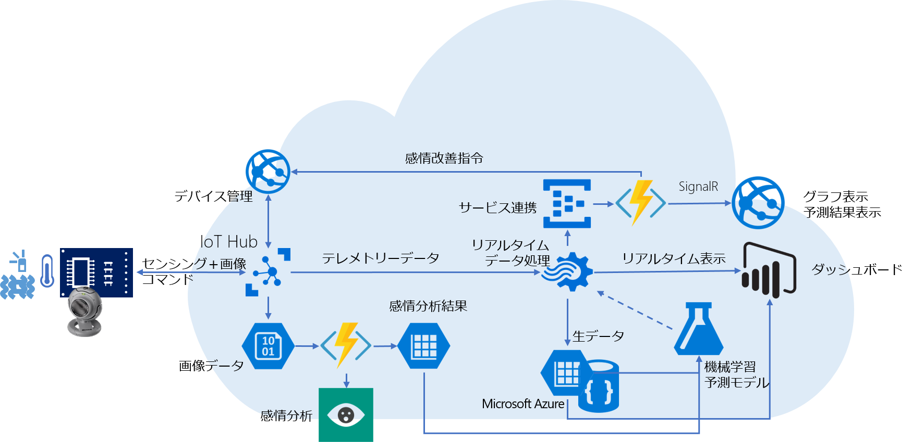

# IoTKitHoLV4 
## 学習コンテンツ 
- [全体](https://1drv.ms/p/s!Aihe6QsTtyqct5NOzof1p8JH3XQdUQ)  
- [第一章](https://1drv.ms/p/s!Aihe6QsTtyqct5NQBGA32Y7fOV06hA)  
- [第二章](https://1drv.ms/p/s!Aihe6QsTtyqct5NPsPTykYx8VQ6aNw)  
- 第三章 - 準備中 
- [Raspbian/Raspberry Pi3+TI CC2650 + IoT Edge SDK](https://1drv.ms/p/s!Aihe6QsTtyqct5NNh7x8T_5g0zXQuw)  

## 対応デバイス 
ハンズオンで使用可能なデバイスリストは[こちら](./DeviceList.md) 

## ハンズオン全体像  

